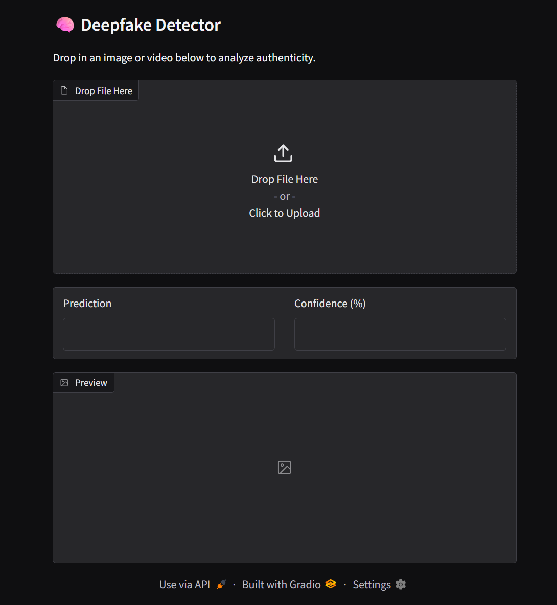
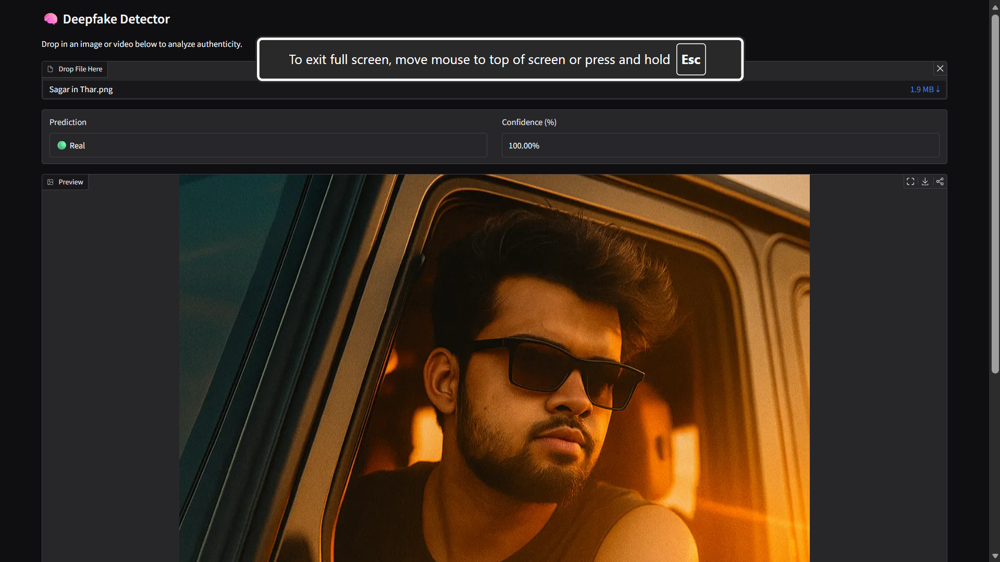
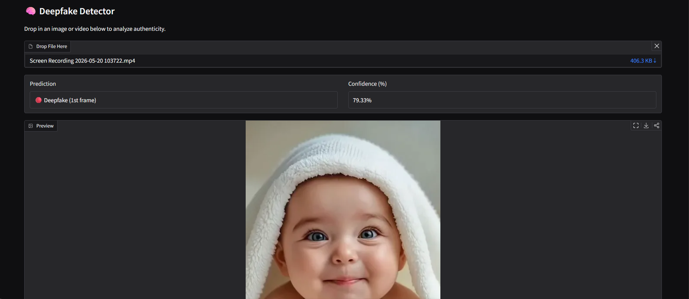

# 🎭 Deepfake Detector


An AI-powered Deepfake Detection System built using **PyTorch**, **EfficientNet-B0**, and **Gradio**. The application can analyze both **images** and **videos** to detect manipulated content and provide confidence-based predictions in real time.

---

## 👨‍💻 Author

**Sagar Bhati**

GitHub: https://github.com/sagarbhati23

---

## 📸 Screenshots

### Home Page



### Image Prediction



### Video Prediction



### Project Demonstration


---

## 🚀 Features

* Deepfake detection for both images and videos
* Fine-tuned EfficientNet-B0 model
* Interactive Gradio web interface
* Real-time predictions with confidence scores
* PyTorch Lightning training pipeline
* ONNX export support
* Support for JPG, JPEG, PNG, MP4, and MOV files

---

## 🎯 Project Highlights

* Built and integrated the complete system independently
* Developed an end-to-end deep learning pipeline
* Implemented image and video inference workflows
* Designed a user-friendly web interface using Gradio
* Export-ready model deployment support

---

## 🎯 Project Motivation

With the growing availability of AI-generated media, detecting manipulated content has become increasingly important. This project explores deep learning and computer vision techniques for identifying deepfake images and videos using EfficientNet-B0 and modern deployment tools.

---

## 💻 Tech Stack

### Machine Learning

* Python
* PyTorch
* PyTorch Lightning
* EfficientNet-B0

### Computer Vision

* OpenCV
* NumPy
* Pillow

### Frontend & Deployment

* Gradio
* ONNX

### Tools

* Git
* GitHub

---

## ⚙️ Installation

### Clone Repository

```bash
git clone https://github.com/sagarbhati23/deepfake-detector.git
cd deepfake-detector
```

### Install Dependencies

```bash
pip install -r requirements.txt
```

### Place Model File

```text
models/best_model-v3.pt
```

---

## 🖥️ Run Web Application

```bash
python app.py
```

---

## 🔍 Image Classification

```bash
python classify.py path/to/image.jpg
```

---

## 🎥 Video Analysis

```bash
python inference/video_inference.py
```

---

## 📊 Model Architecture

* Backbone: EfficientNet-B0
* Input Size: 224 × 224 RGB Images
* Binary Classification: Real / Fake
* Confidence-Based Predictions
* Transfer Learning & Fine-Tuning

---

## 📈 Performance

* Real-time inference
* Image and video support
* Multi-frame video analysis
* Confidence score generation
* Robustness testing with image degradation simulations

---

## 🚀 Future Improvements

* Face detection before classification
* Temporal video analysis
* REST API integration
* Explainable AI using Grad-CAM
* Mobile deployment support

---

## 🤝 Contributing

Contributions are welcome. Feel free to fork the repository, create a feature branch, and submit a pull request.


